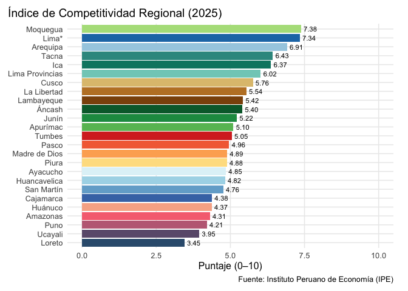

<!-- README.md is generated from README.Rmd. Please edit that file -->

# incorer

<!-- badges: start -->

<!-- badges: end -->

El objetivo de incorer es facilitar el acceso, organización y
visualización de los datos del Índice de Competitividad Regional
(INCORE) elaborado por el Instituto Peruano de Economía (IPE).

El INCORE es una herramienta estadística que mide la competitividad de
las 25 regiones del Perú mediante seis pilares clave: Entorno Económico,
Laboral, Infraestructura, Salud, Educación e Instituciones . Cada
región obtiene un puntaje en una escala de 0 a 10, lo que permite
identificar brechas, avances y retos en el desarrollo regional.

Este paquete no está afiliado al IPE, pero nace con el propósito de
poner a disposición de la comunidad académica, de política pública y
ciudadanía una vía directa para integrar la información del INCORE en R,
con funciones que simplifican la lectura de bases, elaboración de tablas
y construcción de visualizaciones reproducibles.

En el contexto de una creciente necesidad de análisis territorial y
evidencia para la toma de decisiones, incorer busca convertirse en un
recurso abierto que permita estudiar las desigualdades regionales,
explorar relaciones entre indicadores y facilitar la comunicación de
resultados.

## Instalación

Puedes instalar el paquete así:

``` r
# install.packages("devtools")
devtools::install_github("GonzaloAlmendariz/incorer")
```

## Ejemplos

Este es un ejemplo básico que muestra cómo cargar el paquete y traer
resultados del INCORE:

``` r
library(incorer)

# Cargar resultados generales de la edición 2025
df <- leer_incore(edicion = 2025)
#> Descargando datos desde la web…
#> Importando y limpiando datos…
#> Filtrando a 'Puntaje del 0 al 10': 12740 filas (de 23660).
#> Aplicando filtros seleccionados…
#> Datos listos: 1274 filas, 11 columnas (solo puntaje 0–10).

head(df)
#> # A tibble: 6 × 11
#>   edicion pilar     indicador unidad fuente nota  region etiqueta valor posicion
#>     <int> <chr>     <chr>     <chr>  <chr>  <chr> <chr>  <chr>    <dbl>    <int>
#> 1    2025 Índice d… General   Punta… IPE    <NA>  Amazo… AMZ       4.31       22
#> 2    2025 Índice d… General   Punta… IPE    <NA>  Áncash ÁNC       5.40       10
#> 3    2025 Índice d… General   Punta… IPE    <NA>  Apurí… APC       5.10       12
#> 4    2025 Índice d… General   Punta… IPE    <NA>  Arequ… AQP       6.91        3
#> 5    2025 Índice d… General   Punta… IPE    <NA>  Ayacu… AYA       4.85       17
#> 6    2025 Índice d… General   Punta… IPE    <NA>  Cajam… CJM       4.38       20
#> # ℹ 1 more variable: anio <int>
```

Ejemplo de visualización

``` r
# Gráfico de barras con resultados generales
graf <- general_barras(edicion = 2025)
graf
```



## Créditos

    •   Los datos y la elaboración del Índice de Competitividad Regional (INCORE) son responsabilidad exclusiva del Instituto Peruano de Economía (IPE).
    •   El paquete incorer ha sido desarrollado de manera independiente, con el objetivo de acercar esta valiosa información a investigadores, docentes, estudiantes y profesionales de políticas públicas en un entorno reproducible de R.
